# FeedIn Video Livestream System — Complete Architecture

## System Overview Diagram

```mermaid
graph TD
    subgraph Entry["Entry Points"]
        LP[Live Page /live]
        LSD[LiveStreamDetail /live/:streamId]
        CSM[CreateLiveStreamModal]
    end

    subgraph Core["Core Stream Room"]
        TSR[TwitterStreamRoom.tsx - 1500+ lines]
        LK[LiveKit SDK - Video/Audio]
        VT[Video Track h720]
        AT[Audio Track - Echo/Noise Cancel]
    end

    subgraph Context["Global State"]
        LSC[LiveStreamContext.tsx]
        Room[LiveKit Room Ref]
        Tracks[Video/Audio Track Refs]
        FSP[FloatingStreamPlayer - PiP]
    end

    subgraph Chat["Real-time Chat"]
        BC[Supabase Broadcast Channel]
        CM[Chat Messages - Optimistic]
        FlyChat[Flying Chat UI - Left Aligned]
        AutoScroll[Auto-scroll with Mask Gradient]
    end

    subgraph Gifts["Gift System 85/15 Split"]
        QGB[QuickGiftBar]
        LGM[LiveGiftModal]
        RPC[send_live_gift RPC]
        GA[gift_analytics Table]
        PW[platform_wallet - 15% Fee]
        CE[Creator Earnings - 85%]
    end

    subgraph PK["PK Battle System"]
        PKH[usePKBattle Hook]
        PKEF[pk-battle-manager Edge Function]
        PKBar[PKBattleBar - Score/HP UI]
        PKC[PKBattleChallenge - Matchmaking]
    end

    subgraph Controls["Stream Controls"]
        Cam[Camera Flip + Fallback]
        Mute[Mute/Unmute]
        Share[Share Stream]
        Heart[Heart Reaction]
        Settings[Settings Modal]
    end

    subgraph Access["Access Control"]
        SUB[useSubscriptionFeatures]
        LSP[useLivestreamPermission]
        Tier[creditTierLevel >= 2 Required]
        Bypass[Admin/Mod/Dev Bypass]
    end

    subgraph Backend["Backend Infrastructure"]
        LKT[livekit-token Edge Function]
        DB[(live_streams Table)]
        MSG[(live_stream_messages)]
        GIFTS[(live_stream_gifts)]
        PKT[(pk_battles Table)]
    end

    LP --> CSM
    LP --> LSD
    LSD --> TSR
    CSM --> LSD

    TSR --> LK
    LK --> VT
    LK --> AT
    TSR --> LSC
    LSC --> Room
    LSC --> Tracks
    LSC --> FSP

    TSR --> BC
    BC --> CM
    CM --> FlyChat
    FlyChat --> AutoScroll

    TSR --> QGB
    QGB --> LGM
    LGM --> RPC
    RPC --> GA
    RPC --> PW
    RPC --> CE

    TSR --> PKH
    PKH --> PKEF
    PKH --> PKBar
    PKH --> PKC

    TSR --> Cam
    TSR --> Mute
    TSR --> Share
    TSR --> Heart
    TSR --> Settings

    CSM --> SUB
    SUB --> LSP
    LSP --> Tier
    LSP --> Bypass

    LK --> LKT
    TSR --> DB
    BC --> MSG
    LGM --> GIFTS
    PKH --> PKT
```



---

## 1. Entry Points & Routing

| Route | Component | Purpose |
|-------|-----------|---------|
| `/live` | `LiveDashboard.tsx` | Discovery tabs: Discover (live) + Replays (recorded) |
| `/live/:streamId` | `LiveStreamDetail.tsx` | Preview page → Join button → TwitterStreamRoom |
| Modal | `CreateLiveStreamModal.tsx` | Create Video Broadcast or PK Battle |

---

## 2. Core Stream Room — `TwitterStreamRoom.tsx`

**Style**: TikTok/Tango fullscreen dark UI with gradient overlays.

### Video/Audio (LiveKit)
- **SDK**: `livekit-client` + `@livekit/components-react`
- **Resolution**: `VideoPresets.h720` adaptive streaming
- **Audio**: Echo cancellation, noise suppression, auto gain control
- **Token**: Obtained from `livekit-token` edge function
- **Connection**: Room created with `adaptiveStream: true`, `dynacast: true`

### Camera Flip with Fallback
```typescript
// Flip camera by stopping current track and creating new one
const newTrack = await createLocalVideoTrack({
  facingMode: currentFacing === 'user' ? 'environment' : 'user',
  resolution: VideoPresets.h720,
});
// Unpublish old, publish new
await room.localParticipant.unpublishTrack(oldTrack);
await room.localParticipant.publishTrack(newTrack);
// Fallback: if environment camera fails, stay on 'user'
```

### UI Layout
- **Full-screen video** with gradient overlay (top + bottom)
- **Host pill tag**: Avatar + crown icon + follow button (top-left)
- **Viewer count badge**: Top area
- **Vertical action stack** (right side): Heart, Share, Flip, PK
- **Flying chat** (left-aligned, bottom): Auto-scroll with mask gradients
- **Quick gift bar**: Bottom area above controls
- **Control bar**: Mute, Camera, End/Leave buttons

---

## 3. Global State — `LiveStreamContext.tsx`

Maintains LiveKit connection across route changes for PiP support.

### State Shape
```typescript
interface LiveStreamState {
  isActive: boolean;
  isMinimized: boolean;
  streamInfo: StreamInfo | null;
  isMuted: boolean;
  isCameraOn: boolean;
  isHost: boolean;
  viewerCount: number;
  connectionStatus: 'idle' | 'connecting' | 'connected' | 'reconnecting' | 'error' | 'ended';
}
```

### Key Methods
| Method | Description |
|--------|-------------|
| `startStream(info)` | Get LiveKit token → Create tracks → Connect room → Publish → Update DB to 'live' |
| `endStream()` | Stop tracks → Disconnect room → Cleanup channels → Update DB to 'ended' |
| `minimizeStream()` | Set `isMinimized: true` — broadcast continues in background |
| `maximizeStream()` | Set `isMinimized: false` — return to full view |
| `toggleMute()` | Mute/unmute audio track |
| `toggleCamera()` | Mute/unmute video track |

### Refs (persist across navigation)
- `roomRef` — LiveKit Room instance
- `videoTrackRef` / `audioTrackRef` — Local tracks
- `viewerChannelRef` — Supabase presence channel for viewer count

---

## 4. Floating Player (PiP) — `FloatingStreamPlayer.tsx`

When stream is minimized:
- Small draggable video preview overlay
- Tap to maximize back to full room
- Stream audio/video continues uninterrupted

---

## 5. Real-time Chat System

### Architecture
- **Transport**: Supabase Broadcast Channels (not DB writes for speed)
- **Persistence**: Messages also saved to `live_stream_messages` table
- **Optimistic Updates**: Message appears instantly in sender's UI before broadcast confirmation

### Chat Flow
```
User types message
  → Optimistic append to local state
  → Broadcast via supabase.channel('stream-chat-{id}').send()
  → Other clients receive via .on('broadcast', { event: 'chat' })
  → Persist to live_stream_messages table (async, non-blocking)
```

### UI: Flying Chat
- Left-aligned messages floating up
- Auto-scroll to latest
- Top/bottom gradient masks for fade effect
- Shows sender name, avatar, message content

---

## 6. Broadcast Reactions

### Flow
```
User taps heart/emoji
  → Broadcast via channel.send({ type: 'broadcast', event: 'reaction', payload })
  → All clients render floating emoji animation
  → Emoji rises from tap point with random horizontal drift
  → Fades out after animation duration
```

### Reaction Type
```typescript
interface Reaction {
  id: string | number;
  type: string;
  emoji: string;
  x: number;
  y: number;
  senderName?: string;
}
```

---

## 7. Gift System — 85/15 Revenue Split

### Components
| Component | Purpose |
|-----------|---------|
| `QuickGiftBar` | Horizontal strip of quick-send gift buttons |
| `LiveGiftModal` | Full gift selection modal with categories |
| `GiftAnimation` | Animated gift overlay on stream |
| `SpaceGiftHistory` | Gift history viewer for host |
| `SpaceWalletBoard` | Credit balance + earnings display |

### Transaction Flow (Atomic RPC)
```sql
-- send_live_gift RPC (SECURITY DEFINER)
1. Check sender has enough credits in user_credits
2. Deduct credits from sender
3. Calculate split: creator_amount = gift_value * 0.85
4. Calculate platform_fee = gift_value * 0.15
5. Insert into gift_analytics (unconverted, pending creator redemption)
6. Update platform_wallet (platform_profit += platform_fee)
7. Insert into profits_transactions for audit trail
8. Return success with gift details
```

### Key Tables
| Table | Purpose |
|-------|---------|
| `user_credits` | Sender's balance check + deduction |
| `gift_analytics` | Creator's unconverted gift earnings |
| `platform_wallet` | Platform's 15% fee accumulation |
| `profits_transactions` | Audit trail for all transactions |
| `live_stream_gifts` | Gift event log for the stream |

### Creator Redemption
- Gifts land in `gift_analytics` as **unconverted**
- Creator must manually convert to `user_credits` via wallet UI
- Prevents double-crediting

---

## 8. PK Battle System

### Components
| Component | File | Purpose |
|-----------|------|---------|
| PK Hook | `usePKBattle.ts` | Real-time score sync, battle lifecycle |
| PK Bar | `PKBattleBar.tsx` | Split-screen score/HP bar UI |
| PK Challenge | `PKBattleChallenge.tsx` | Matchmaking & challenge modal |
| PK Manager | `pk-battle-manager` edge fn | Server-side battle lifecycle |

### Battle Flow
```
Host clicks PK button
  → PKBattleChallenge opens
  → Select opponent or random match
  → pk-battle-manager edge function creates battle record
  → Both streamers see PKBattleBar overlay
  → Gifts sent during PK add to respective scores
  → Timer counts down (configurable duration)
  → Winner determined by score
  → Battle record updated with result
```

### PK Data Shape
```typescript
interface PKBattleData {
  id: string;
  challenger: UnifiedUser;
  challengerScore: number;
  hostScore: number;
  timeLeft: number;
  status: 'waiting' | 'active' | 'completed' | 'cancelled';
  durationSeconds: number;
}
```

### Database: `pk_battles` table
- `host_id`, `challenger_id`
- `host_score`, `challenger_score`
- `status`: waiting → active → completed/cancelled
- `duration_seconds`
- `started_at`, `ended_at`

---

## 9. Stream Creation — `CreateLiveStreamModal.tsx`

### Configuration Options
| Option | Details |
|--------|---------|
| Mode | Video Broadcast or PK Battle (pill selector) |
| Title | Required text input |
| Description | Optional textarea |
| Category | Pill selector: Music, Gaming, Tech, Education, etc. |
| Hashtags | Up to 5 dynamic tags |
| Private | Toggle — restricts access |
| Scheduled | Toggle — shows date/time pickers |
| Premium | Toggle — premium-only access |

### Visual Style
- Dark glass: `bg-[#0F1119]`, `rounded-[2.5rem]`
- Hides bottom nav when open
- Validates title presence + future scheduling

---

## 10. Subscription-Based Access Control

### Permission Check
```typescript
// useLivestreamPermission.ts
const { features } = useSubscriptionFeatures();
return {
  canLivestream: features.canLivestream,  // true if tier >= 2
  tierLevel: features.creditTierLevel,
};
```

### Tier Requirements
| Tier | Level | Video Livestream |
|------|-------|-----------------|
| Starter | 1 | Blocked (upgrade prompt) |
| Popular/Basic | 2 | Allowed |
| Pro | 3 | Allowed |
| Premium | 4 | Allowed |
| Admin/Mod/Dev | - | Always allowed (bypass) |

### Enforcement Points
1. `CreateLiveStreamModal` — checks before allowing creation
2. `LiveStreamDetail` — can check before join
3. Audio Spaces — **always available** to all tiers

---

## 11. Settings & Modals

| Modal/Component | Trigger | Purpose |
|----------------|---------|---------|
| `CreateLiveStreamModal` | "Go Live" button on /live | Create new stream |
| `LiveGiftModal` | Gift button in stream | Full gift selection |
| `PKBattleChallenge` | PK button in stream | Start PK battle |
| `SpaceGiftHistory` | Wallet board in stream | View gift history |
| `SpaceWalletBoard` | Credit indicator | Balance + earnings |
| Settings menu | Gear icon | Stream settings (flip, quality) |

---

## 12. Backend Edge Functions

### `livekit-token`
```
Input: { roomName, participantName, participantIdentity, isHost }
Output: { token, url }
Purpose: Generate authenticated LiveKit JWT for room connection
```

### `pk-battle-manager`
```
Input: { action, battleId?, challengerId?, hostId?, duration? }
Actions: create, accept, decline, complete, cancel
Output: { battle: PKBattleRecord }
Purpose: Server-side PK battle lifecycle management
```

---

## 13. Database Schema (Video Livestream)

### `live_streams`
| Column | Type | Purpose |
|--------|------|---------|
| id | uuid | Primary key |
| user_id | uuid | Host's user ID |
| title | text | Stream title |
| description | text | Optional description |
| status | text | scheduled / live / ended |
| room_type | text | video_broadcast / pk_battle |
| category | text | Stream category |
| is_private | boolean | Private stream flag |
| cover_image_url | text | Thumbnail/cover |
| viewer_count | integer | Current viewers |
| scheduled_start | timestamptz | For scheduled streams |
| started_at | timestamptz | Actual start time |
| ended_at | timestamptz | End time |
| created_at | timestamptz | Creation timestamp |

### `live_stream_messages`
| Column | Type | Purpose |
|--------|------|---------|
| id | uuid | Primary key |
| stream_id | uuid | FK to live_streams |
| user_id | uuid | Sender |
| content | text | Message text |
| created_at | timestamptz | Timestamp |

### `live_stream_gifts`
| Column | Type | Purpose |
|--------|------|---------|
| id | uuid | Primary key |
| stream_id | uuid | FK to live_streams |
| sender_id | uuid | Gift sender |
| receiver_id | uuid | Gift receiver (host) |
| gift_type | text | Gift identifier |
| credit_value | integer | Gift cost in credits |
| created_at | timestamptz | Timestamp |

### `pk_battles`
| Column | Type | Purpose |
|--------|------|---------|
| id | uuid | Primary key |
| host_id | uuid | Host streamer |
| challenger_id | uuid | Challenger streamer |
| host_score | integer | Host's gift score |
| challenger_score | integer | Challenger's score |
| status | text | waiting/active/completed/cancelled |
| duration_seconds | integer | Battle duration |
| started_at | timestamptz | Battle start |
| ended_at | timestamptz | Battle end |

---

## 14. Key File Map

| File | Lines | Purpose |
|------|-------|---------|
| `src/components/live/twitter-space/TwitterStreamRoom.tsx` | ~1500 | Main stream room UI |
| `src/context/LiveStreamContext.tsx` | ~358 | Global stream state + LiveKit management |
| `src/pages/LiveStreamDetail.tsx` | ~294 | Stream preview/join page |
| `src/components/live/CreateLiveStreamModal.tsx` | - | Stream creation modal |
| `src/components/live/unified/PKBattleBar.tsx` | - | PK battle score UI |
| `src/components/live/unified/types.ts` | ~79 | Shared type definitions |
| `src/hooks/usePKBattle.ts` | - | PK battle hook |
| `src/hooks/useLivestreamPermission.ts` | ~15 | Permission check |
| `src/components/live/FloatingStreamPlayer.tsx` | - | PiP overlay |
| `supabase/functions/livekit-token/index.ts` | - | LiveKit token generator |
| `supabase/functions/pk-battle-manager/index.ts` | - | PK battle server logic |

---

*Generated from FeedIn codebase — March 2026*
